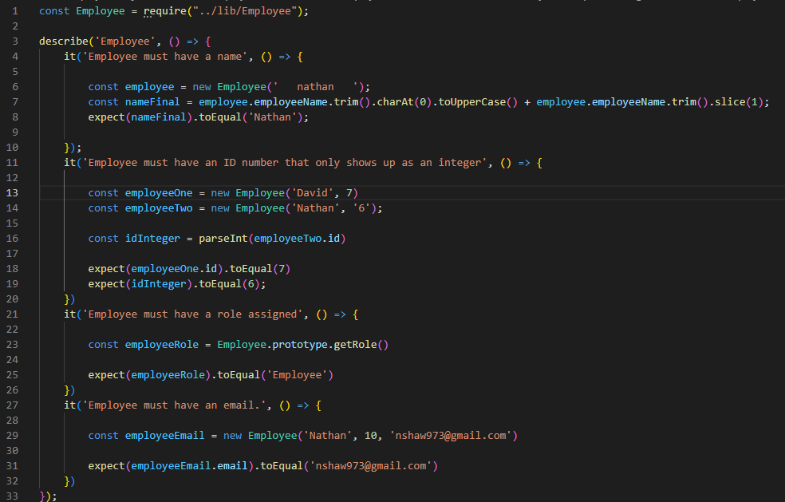
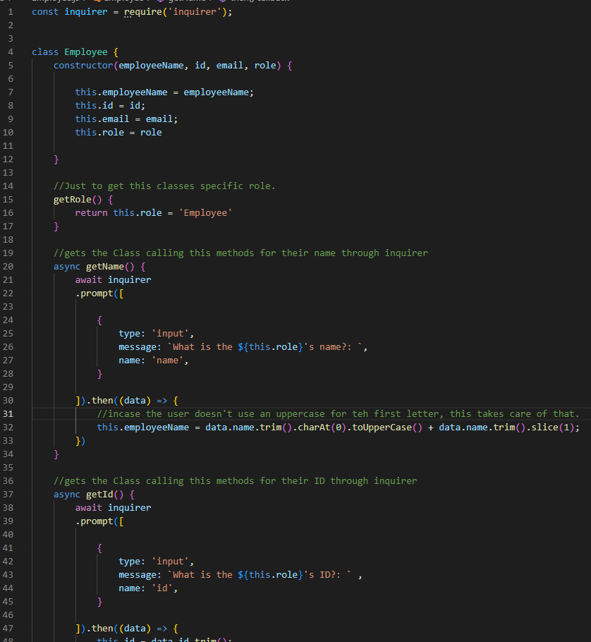
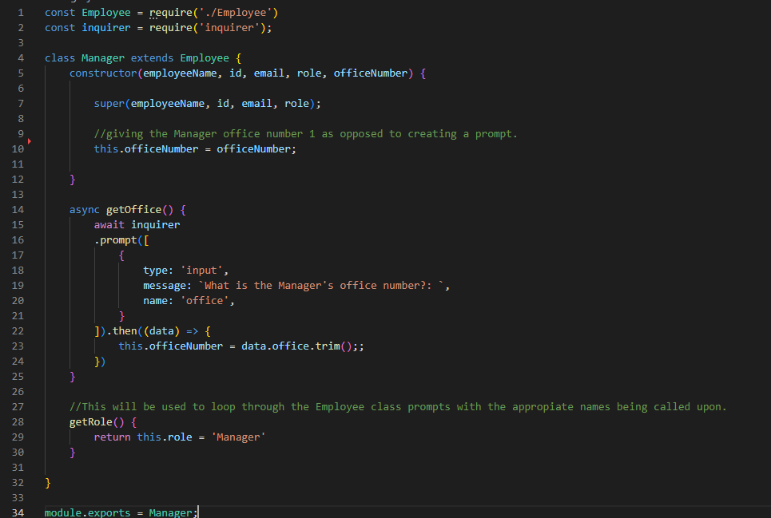
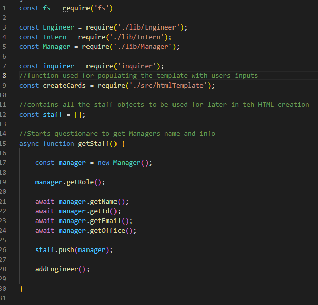
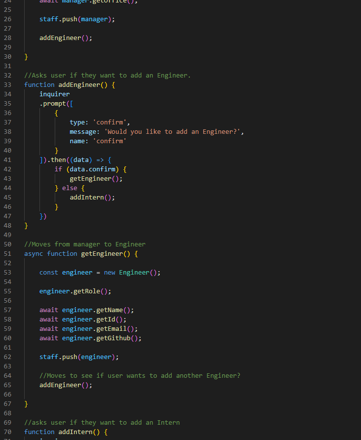
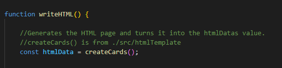
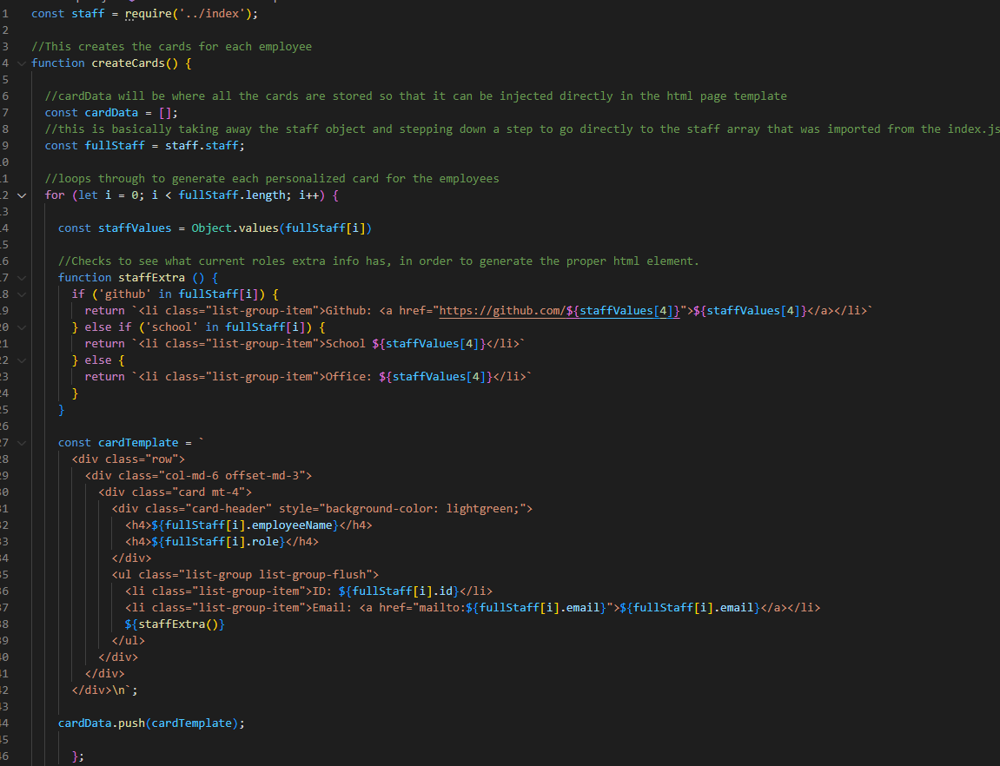
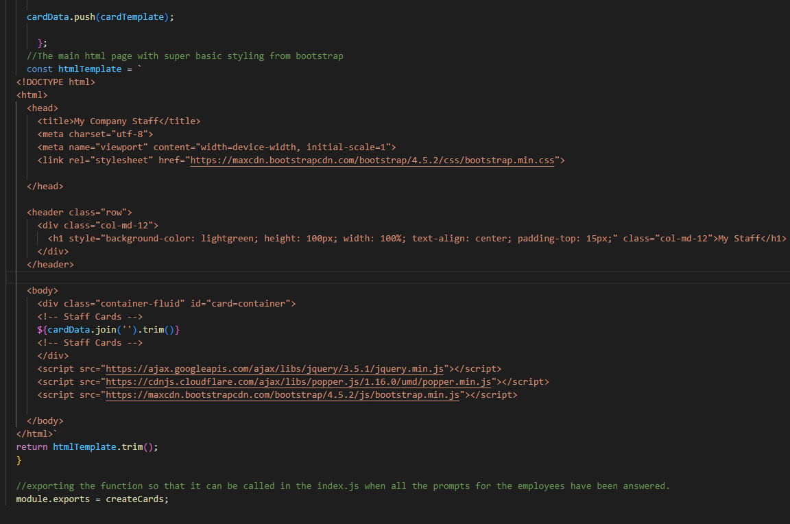
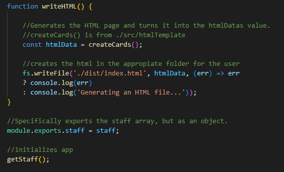

# Challenge-8-Team-Profile-Generator
Challenge # for UCI bootcamp class, for module 10.

## Video Demonstration

[Challenge 8 Video Demonstration](https://drive.google.com/file/d/1qVKeB0E4BXWlL7T91PN7tkR8Ww75-uvM/view?usp=share_link)

## Task

The task was to create a staff generator that creates an html file that populates with cards that contain all the employees info based on the users input.
This is done with Inquirer.

Besides just creating the app, the task required to create a unit test that uses Jest to run tests.
## Code Breakdown

First thing was first, was to get the unit tests created with Jest.
These tests check to see if the classes are running properly.
It runs through each value and messes with them to make sure they are the same as what they are suppose to equal



The main class is going to be the Employee class, with Manager, Engineer, and Intern being subclasses of Employee. 
So I created each method inside the employee class to run through inquirer asking for the current employees info.

The only exception of not using inquirer is the getRole method, but I'll be using it to populate the message with the current employee beiung called.
so under the getName method, the message has ${this.role} so when the prompt shows up it will say "What is the Manager's name?:" or if the engineer is being called, it will say "What is the Engineer's name?:"

When the Name gets returned, I added methods to trim, and get the first letter of the name to uppercase so incase the user forgets to uppercase the name.



The Engineer and Intern classes are going to look very much like this, with the exception of just differntly name variables and with their specific prompt.

The Manager class extends to the Employee class, giving me access to all the methods the Employee class also has, super gives me access to the variables from the Employee class.

just like before, the getRole() function is just Returning Manager to make sure the prompts are giving the right names for each prompt asked. 
Then module.exports, just exports the Manager class that will get used in the tests, and the index.js file.



first thing was to get all the classes, inquirer and then a function from the htmlTemplate file.

The main part of this index.js is to just go through all the prompts by calling through the employee class through the multiple subclasses, which lowers the amount of code needed to ask all bunch of prompts for each Employee.

in order to get the prompts to appear without any errors, addid async to the function allows me to go through the methods one by one until each one fufills completely. aka promises. await turns each method into an asynchronous function so that in order to move onto the next method, the prompts must be fufullied first.



at this point in the code, once the manager has been given their information, the user is then prompted through the addEngineer function that will ask the user if they want to add and Engineer. 

If they say no, then it moves to intern, and if they say no, then the html is crated with just the manager card.

if the user says yes, then they are prompted through the methods in employee with Engineer populating.

Once each prompt has been answered, the user will be asked if they want to add another engineer, or intern depending on what employee type they are currently on.



After all the employees have been added, then the writeHTML() function is invoked, and the first function in there is the createCards() function which, takes us to the htmlTemplate.js file, that has teh html that will be used to create the index.html for the user.



I imported the staff array that was being used in the index.js, which stores all the employees created, in an object.

the cardData array, is used to house all the cards that will be created from the for loop that goes through each employee and adds their info.

the fullStaff variable is created. to remove the object that was brough in, so it will be easier to use the for loop to move about the array.

the function staffExtra is created to create the specific html elements that each employee has, such as office number for manager, or github for engineer. the if conditional is just checking if the current object has a specific variable in them, which is why I'm using "in", to check to see which variable is in the object.

the card template is just teh basic html that has bootstrap to create the cards.
Then each time a card is created, its pushed to the cardData array.



This is just the html boiler plate, which just has the card data with the join('') function in order to get rid of the commas that the array created, and gets all the cards into a single string. then trim() to get rid of the white space from the way the html is present in the code.

after that this funciton is then exported and moved to te index.js.



Lastly, fs is called to create the html page, by taking the createCards() function and turning it into a value for the htmlData variable. and using it to populate the index.html with everything the user had inputed.



## User Story

```md
AS A manager
I WANT to generate a webpage that displays my team's basic info
SO THAT I have quick access to their emails and GitHub profiles
```

## Acceptance Criteria

```md
GIVEN a command-line application that accepts user input
WHEN I am prompted for my team members and their information
THEN an HTML file is generated that displays a nicely formatted team roster based on user input
WHEN I click on an email address in the HTML
THEN my default email program opens and populates the TO field of the email with the address
WHEN I click on the GitHub username
THEN that GitHub profile opens in a new tab
WHEN I start the application
THEN I am prompted to enter the team manager’s name, employee ID, email address, and office number
WHEN I enter the team manager’s name, employee ID, email address, and office number
THEN I am presented with a menu with the option to add an engineer or an intern or to finish building my team
WHEN I select the engineer option
THEN I am prompted to enter the engineer’s name, ID, email, and GitHub username, and I am taken back to the menu
WHEN I select the intern option
THEN I am prompted to enter the intern’s name, ID, email, and school, and I am taken back to the menu
WHEN I decide to finish building my team
THEN I exit the application, and the HTML is generated
```